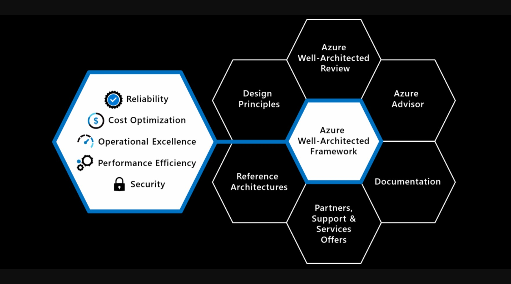
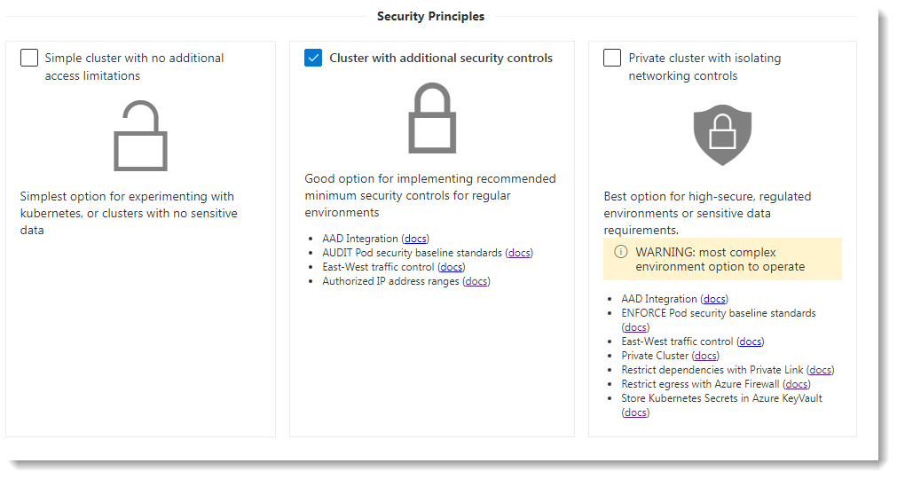

# IDS AKS Accelerator

It can be extremely challenging to design and deploy a Kubernetes cluster that is Enterprise ready. You have to deal with complex ARM Templates, syntax errors, and potentially hundreds of parameters. The entire deployment can fail if one of them is wrong, leaving partially deployed resources to clean up. Time is wasted, leading to frustration.

## How Randstad helped the ABC Data Science team

The Randstad IDS Cloud Practice developed a simple, secure, lightweight, and flexible solution to streamline AKS configuration and deployment.

### Critical requirements and success factors

* User-friendly and easy to understand
* Delivers repeatable results and predictable infrastructure
* Provides flexible configuration options that can be easily modified to incorporate future features, patterns, or frameworks
* Reduce post-deployment AKS configuration requirements
* Fully automated, includes testing, and is efficient and streamlined.

### Guiding Principals

The focus is on the downstream application of the parameters. "Shift Left" - Integrate security and compliance earlier into IaC & CI/CD pipelines. Our specific practices are as follows:

1. Deploy all components through a single, modular, idempotent bicep template
2. Converge on a single bicep template, which can easily be consumed as a module
3. Provide best-practice defaults, then use parameters for different environment deployments
4. Minimise "manual" steps for ease of automation
5. Maintain quality through pre-validation, regression tests, and CI/CD pipelines
6. Focus on AKS and supporting services, linking to other repos to solve Demo apps / Developer workstations / Jumpboxes / CI Build Agents / Certificate Authorities

### Reference architectures, baselines, frameworks, and best practices

Randstad leveraged and incorporated numerous Architectural approaches, frameworks, best practices, and security controls to ensure an optimal AKS cluster design and automated deployment process.

* [AzOps-Accelerator](https://github.com/RTmtfiallos/AzOps-Accelerator)

  * Used in Azure DevOps and GitHub to baseline, pull, push, & validate Azure resources such as policyDefinitions, policyAssignments and roleAssignments.
    

* [AKS Secure Baseline {Private Cluster}](https://docs.microsoft.com/en-us/azure/architecture/reference-architectures/containers/aks/secure-baseline-aks)

  * The AKS bicep code is based on the architecture of the AKS Baseline, the Well Architected Framework. It has been highly customized by Randstad to ensure quality deployments with the highest degree of confidence os success. The end result is a fully validated infrastructure before it has been deployed.
  * "Shifting-Left" as much as possible, ensuring AKS is truly 'Well Architected' and fully 'Secure'.
  * Much of the code and configuration in this project is based off the work in the AKS Baseline, the philosophy however, is different.
  * The AKS Baseline covers much of the documentation and practices, and this project focuses on the [implementation experience](https://rtmtfiallos.github.io/ABC-AKS/helper/public/) and [automation samples](https://github.com/RTmtfiallos/ABC-AKS/tree/main/.github/workflows).
    

* [Well Architected Framework](https://docs.microsoft.com/en-us/azure/architecture/framework/)

  * The Azure Well-Architected Framework is a set of guiding tenets that can be used to improve the quality of a workload. The framework consists of five pillars of architectural excellence:

    * Reliability
    * Security
    * Cost Optimization
    * Operational Excellence
    * Performance Efficiency

   

  

 

* In the center, is the Well-Architected Framework, which includes the five pillars of architectural excellence. Surrounding the Well-Architected Framework are six supporting elements:

  * Azure Well-Architected Review
  * Azure Advisor
  * Documentation
  * Partners, Support, and Services Offers
  * Reference Architectures
  * Design Principles

* [Cloud Adoption Framework](https://azure.microsoft.com/en-gb/cloud-adoption-framework/)

  * The Cloud Adoption Framework is a collection of documentation, implementation guidance, best practices, and tools that are proven guidance from Microsoft designed to accelerate your cloud adoption journey.
     

* [PSRule for Azure Reference](https://azure.github.io/PSRule.Rules.Azure/en/rules/module/)

  * PSRule for Azure includes over 250 rules for validating resources against configuration recommendations.
    Rules automatically detect and analyze resources from Azure IaC artifacts.
  * Pre-flight validation can be integrated into a continuous integration (CI) pipeline as unit tests to:
    * Shift-left — Identify configuration issues and provide fast feedback in PRs.
    * Quality gates — Implement quality gates between environments such as development, test, and production.
    * Monitor continuously — Perform ongoing checks for configuration optimization opportunities.

* [Enterprise-Scale](https://github.com/Azure/Enterprise-Scale)

  * Enterprise Scale provides prescriptive guidance based on authoritative design for the Azure platform as a whole.
  * The [RT AKS Deployment Helper](https://rtmtfiallos.github.io/ABC-AKS/helper/public/) has an Enterprise-Scale lens, with preset configurations for each landing zone area.

* [Enterprise Scale for AKS](https://docs.microsoft.com/en-us/azure/cloud-adoption-framework/scenarios/aks/enterprise-scale-landing-zone/)

  * The reference implementations in this repository are all focussed on guiding the creation of Landing Zones for AKS within an Enterprise Scale framework. They typically include deployments of Hub/Spoke infrastructure and development vm's, and includes a Terraform implementation.

* [Azure Policy for AKS](https://docs.microsoft.com/en-us/azure/aks/policy-reference)

  * Built-in policy definitions for Azure Kubernetes Service

 

As a result, ABC is able to quickly deploy the Azure Kubernetes Service as well as container workloads, using tested/proven best practices and a flexible templating approach to address differing business and IT requirements.

 

## The 3 Main Components & Building Blocks for the solution

### Wizard experience

To help guide ABC's initial AKS configuration and fully automate the deployment of the Dev & Production ABC AKS clusters, use the developed and highly customizeable [RT AKS Deployment Helper](https://rtmtfiallos.github.io/ABC-AKS/helper/public/).

The AKS Deployment helper will provide a set of parameters and scripts to make deployment simple and fully automated. It uses several preset configurations, patterns, and building blocks to guide configuration decisions.

If requirements change, or if there is a need for another AKS Cluster you can simply ceate a new set of deployment files to use whenever needed.

We've broken it down to 2 sets of principles to help balance flexibility, function, and costs; **Operations & Security Principles.**

 

The deployment helper provides links to the official Microsoft documentation to help provide additional context for each feature.

### IaC - Bicep code files

IaC (Infrastructure as Code) code files have been modularised into their component areas. [Main.bicep](https://github.com/RTmtfiallos/ABC-AKS/blob/main/bicep/main.bicep) references them and they are expected to be present in the same directory. The Deployment Helper leverages an Arm json compiled version of all the bicep files.

### DevOps - GitHub Actions

A number of [GitHub actions](https://github.com/RTmtfiallos/ABC-AKS/tree/main/.github/workflows) are used in the repo that run on push/pr/schedules. These can be copied into your own repo and customised for your CI/CD pipeline. A robust deployment pipeline is essential when coordinating the deployment of multiple Azure services that work together, additionally there is configuration that cannot be set in the template and that needs to be automated (and tested) consistently.

| CI Name         | Actions Workflow                                                                                                | Parameter file                                                                                                                           | CI Status | Notes                                                                                |
| ----------------- | ----------------------------------------------------------------------------------------------------------------- | ------------------------------------------------------------------------------------------------------------------------------------------ | ----------- | -------------------------------------------------------------------------------------- |
| Starter cluster | [StandardCI.yml](https://github.com/RTmtfiallos/ABC-AKS/blob/main/.github/workflows/StandardCI.yml)             | [ESLZ Sandbox](https://github.com/RTmtfiallos/ABC-AKS/blob/main/.github/workflows_dep/AksDeploy-Basic.parameters.json)                   |           | A simple deployment example, good for first time users of this project to start with |
| BYO Vnet        | [ByoVnetCI.yml](https://github.com/RTmtfiallos/ABC-AKS/blob/main/.github/workflows/ByoVnetCI.yml)               | [ESLZ Byo peered vnet](https://github.com/RTmtfiallos/ABC-AKS/blob/main/.github/workflows_dep/AksDeployByoVnet.parameters.jso)           |           | Comprehensive IaC flow deploying multiple smoke-test apps                            |
| Private cluster | [ByoVnetPrivateCI.yml](https://github.com/RTmtfiallos/ABC-AKS/blob/main/.github/workflows/ByoVnetPrivateCI.yml) | [ESLZ Byo private vnet](https://github.com/RTmtfiallos/ABC-AKS/blob/main/.github/workflows_dep/AksDeploy-ByoVnetPrivate.parameters.json) |           | As above, but with a focus on private networking                                     |

For a more in depth look at the GitHub Actions created, which steps are performed and the different CI practices they demonstrate, please refer to [this page](GhActions.md).

 

## Getting Started

### Basic

If this is the first time you are working with Bicep files, follow these steps.

1. Use the [Deployment Helper](https://rtmtfiallos.github.io/ABC-AKS/helper/public/) to guide your AKS configuration.
2. Run the commands in the*Provision Environment* tab to create your AKS Environment in your Azure subscription
3. Run the commands in the*Post Configuration* tab to complete your implementation
4. [Connect to your AKS Cluster](https://docs.microsoft.com/en-us/azure/aks/kubernetes-walkthrough#connect-to-the-cluster), and deploy your applications as you see fit.

### Mature/Advanced

If you're looking to the raw data as part of your deployments, follow these steps.

1. Use the [Deployment Helper](https://rtmtfiallos.github.io/ABC-AKS/helper/public/) to guide your AKS configuration.
2. Capture the parameters on the*Template Parameters File* tab to a file - this is your configuration
3. Check the *Post Configuration* tab for any commands and save them to a file
4. Grab the [latest release](https://github.com/Azure/Aks-Construction/releases) of the bicep code
5. (optionally) Author an Application Main bicep to represent*your application* (see [here](https://github.com/RTmtfiallos/ABC-AKS/blob/main/bicep/samples/SampleAppMain.bicep) for an example)
6. In your CI/CD system, either using one of the GitHub Action Workflow files as a base, or by coding it yourself - initiate a deployment of the bicep code, using your parameter file
7. In your CI/CD system, deploy your application(s) to the AKS cluster

## Deviations from the baseline (and why)

1. System pool and user pool separation is made optional in interests of users seeking a cost optimised configuration.
2. Ingress. Supports no ingress, [AGIC](https://azure.github.io/application-gateway-kubernetes-ingress/) integrated experience or post deployment ingress scripts for [NGINX](https://docs.nginx.com/nginx-ingress-controller/) and [Contour](https://github.com/projectcontour/contour).
3. Networking. Hub/Spoke networks typically already exist, and tightly bundling with Kubernetes doesn't work well here. BYO subnets are supported.
4. AppGw Public Listener. AppGw is the WAF ingress point for inbound internet traffic, however private listeners are also valid for fully private environments.
5. Cluster SLA. Is defaulted to off in interests of a more cost optimised default configuration, a parameter can be provided to opt in for the paid SLA.
6. Monitoring Alerts. Parametrised metric analysis frequency, created two presets (1 as per baseline, 2 less frequent), set default to be much less frequent. Added extra monitoring alerts as per in-cluster suggestions.
