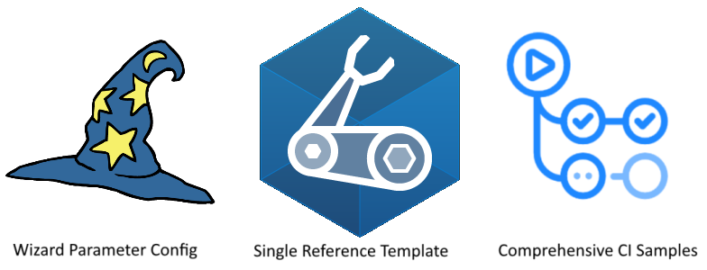
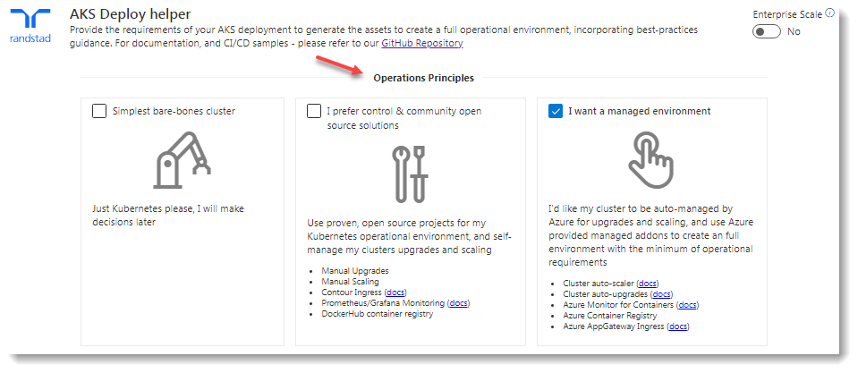
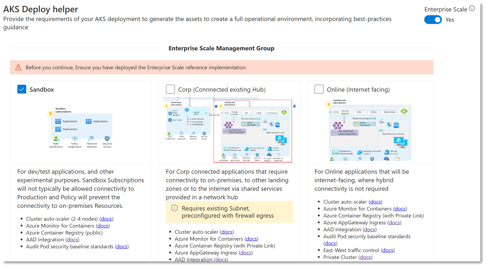
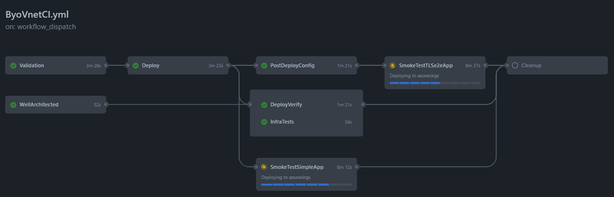

# AKS Deploy Helper / Configurator

Building an Enterprise ready Kubernetes cluster is extremely complex and can be challenging. If you add in finiky ARM Templates, syntax errors, and potentially hundreds of parameters to get just exactly right it's a nightmare.  So much time can be wasted and frustration builds.

The Randstad team focused on developing an IaC solution for AKS that meets the ABC requirements and is:
* Simple to use and understand
* Delivers repeatble results and expected infrastructre
* Has flexible configration options that can be easily modified to include new features/patterns/frameworks in the future
* Minimize post deployment AKS configurtion needs
* Can be fully automated, effcient, and streamlined

 

As a result, ABC is able to quickly deploy the Azure Kubernetes Service as well as container workloads, using tested/proven best practices and a flexible templating approach to address differing business and IT requirements.

 

> Randstad I have combined guidance, automated at all costs - wherever possible, and have taken the best of what the community projects had to offer.

> Randstad leveraged the following Architecural approaches, frameworks, best practices, and security controls to ensure an optimal AKS cluster deployment as well as being very secure

> [AzOps-Accelerator](https://github.com/RTmtfiallos/AzOps-Accelerator), [AKS Secure Baseline](https://docs.microsoft.com/en-us/azure/architecture/reference-architectures/containers/aks/secure-baseline-aks) (Private), [Well Architected Framework](https://docs.microsoft.com/en-us/azure/architecture/framework/), [Cloud Adoption Framework](https://azure.microsoft.com/en-gb/cloud-adoption-framework/), [the PSRule for Azure Reference](https://azure.github.io/PSRule.Rules.Azure/en/rules/module/), [Enterprise-Scale](https://github.com/Azure/Enterprise-Scale) and Enterprise Scale AKS by providing tangible artifacts to deploy Azure resources from CLI or CI/CD systems.
 

 Click here for details on the above frameworks, references, & architectures

AzOps-Accelerator

'''* Azure CLI
* Helm/Tiller

AKS Secure Baseline (Private Clister)

'''* Azure CLI
* Helm/Tiller

Well Architected Framework

'''* Azure CLI
* Helm/Tiller

Cloud Adoption Framework

'''* Azure CLI
* Helm/Tiller

PSRule for Azure Reference

'''* Azure CLI
* Helm/Tiller

Enterprise Scale

'''* Azure CLI
* Helm/Tiller

Enteprise Scale for AZS

'''* Azure CLI
  * Helm/Tiller

## The 3 Main Components & Building Blocks

The Randstad team will focus equally over the following 3 areas:

### Wizard experience

To help guide ABC's initial AKS configuration and fully automate the deployment of the Dev & Production ABC AKS cluster, use the developed and highly customizeable [RT AKS Deployment Helper](https://rtmtfiallos.github.io/ABC-AKS/helper/public/), which will provide a set of parameters and scripts to make deployment simple and fully automated. It uses several preset configurations, ptterns, and building blocks to guide configuration decisions.

If requirements change, or if there is a need for another AKS Clusterx you can simply ceate a new set of deployment files to use whenever needed.

We've broken it down to 2 sets of principles to help balance flexibility, function, and costs; **Operations & Security Principles.**

The deployment helper provides links to the official Microsoft documentation to help provide additional context for each feature.

### IaC - Bicep code files

IaC (Infrastructure as Code) code files have been modularised into their component areas. [Main.bicep](https://github.com/RTmtfiallos/ABC-AKS/blob/main/bicep/main.bicep) references them and they are expected to be present in the same directory. The Deployment Helper leverages an Arm json compiled version of all the bicep files.

Releases are used to version the bicep code files, they can be leveraged directly for use in your project or you can opt to Fork the repo if you prefer.

The following modules have been commited to the rtdeployed for this project and suiatble to immediate reuse.

### DevOps - GitHub Actions

A number of [GitHub actions](https://github.com/RTmtfiallos/ABC-AKS/tree/main/.github/workflows) are used in the repo that run on push/pr/schedules. These can be copied into your own repo and customised for your CI/CD pipeline. A robust deployment pipeline is essential when coordinating the deployment of multiple Azure services that work together, additionally there is configuration that cannot be set in the template and that needs to be automated (and tested) consistently.

| CI Name         | Actions Workflow                                                                                                | Parameter file                                                                                                                           | CI Status                                                                                                                                                                                           | Notes                                                                                |
| ----------------- | ----------------------------------------------------------------------------------------------------------------- | ------------------------------------------------------------------------------------------------------------------------------------------ | ----------------------------------------------------------------------------------------------------------------------------------------------------------------------------------------------------- | -------------------------------------------------------------------------------------- |
| Starter cluster | [StandardCI.yml](https://github.com/RTmtfiallos/ABC-AKS/blob/main/.github/workflows/StandardCI.yml)             | [ESLZ Sandbox](https://github.com/RTmtfiallos/ABC-AKS/blob/main/.github/workflows_dep/AksDeploy-Basic.parameters.json)                   |                 | A simple deployment example, good for first time users of this project to start with |
| BYO Vnet        | [ByoVnetCI.yml](https://github.com/RTmtfiallos/ABC-AKS/blob/main/.github/workflows/ByoVnetCI.yml)               | [ESLZ Byo peered vnet](https://github.com/RTmtfiallos/ABC-AKS/blob/main/.github/workflows_dep/AksDeployByoVnet.parameters.jso)           |           | Comprehensive IaC flow deploying multiple smoke-test apps                            |
| Private cluster | [ByoVnetPrivateCI.yml](https://github.com/RTmtfiallos/ABC-AKS/blob/main/.github/workflows/ByoVnetPrivateCI.yml) | [ESLZ Byo private vnet](https://github.com/RTmtfiallos/ABC-AKS/blob/main/.github/workflows_dep/AksDeploy-ByoVnetPrivate.parameters.json) |  | As above, but with a focus on private networking                                     |

For a more in depth look at the GitHub Actions I created, which steps are performed and the different CI practices they demonstrate, please refer to [this page](https://github.com/RTmtfiallos/ABC-AKS/GhActions.md).

## Getting Started

### Basic

If this is the first time you are working with Bicep files, follow these steps.

1. Use the [Deployment Helper](https://rtmtfiallos.github.io/ABC-AKS/helper/public/) to guide your AKS configuration.
2. Run the commands in the *Provision Environment* tab to create your AKS Environment in your Azure subscription
3. Run the commands in the *Post Configuration* tab to complete your implementation
4. [Connect to your AKS Cluster](https://docs.microsoft.com/en-us/azure/aks/kubernetes-walkthrough#connect-to-the-cluster), and deploy your applications as you see fit.

### Mature/Advanced

If you're looking to the raw data as part of your deployments, follow these steps.

1. Use the [Deployment Helper](https://rtmtfiallos.github.io/ABC-AKS/helper/public/) to guide your AKS configuration.
2. Capture the parameters on the *Template Parameters File* tab to a file - this is your configuration
3. Check the *Post Configuration* tab for any commands and save them to a file
4. Grab the [latest release](https://github.com/Azure/Aks-Construction/releases) of the bicep code
5. (optionally) Author an Application Main bicep to represent *your application* (see [here](https://github.com/RTmtfiallos/ABC-AKS/blob/main/bicep/samples/SampleAppMain.bicep) for an example)
6. In your CI/CD system, either using one of the GitHub Action Workflow files as a base, or by coding it yourself - initiate a deployment of the bicep code, using your parameter file
7. In your CI/CD system, deploy your application(s) to the AKS cluster

## Guiding Principals

The guiding principal we have with is to focus on the the *downstream use* of the the parameters. As such, these are our specific practices.

1. Deploy all components through a single, modular, idempotent bicep template Converge on a single bicep template, which can easily be consumed as a module
2. Provide best-practice defaults, then use parameters for different environment deployments
3. Minimise "manual" steps for ease of automation
4. Maintain quality through validation & CI/CD pipelines that also serve as working samples/docs
5. Focus on AKS and supporting services, linking to other repos to solve; Demo apps / Developer workstations / Jumpboxes / CI Build Agents / Certificate Authorities
